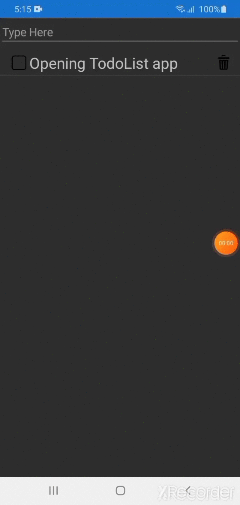

# TodoList App
## My First Android app with Xamarin(C#) framework.

Hello, My name is Abdella Solomon, This is a todo list app that is made using xamarin C# framework.
It is used for adding yoyr todo tasks for today, toggle them if you are done with it and finally delete them if they are not needed

## How to run the code?
To run the code, you have to download the apk under the release page here https://github.com/Abdesol/TodoListApp-xamarin/releases/tag/1.0

## How it works?
 

I hope you enjoyed my app.
